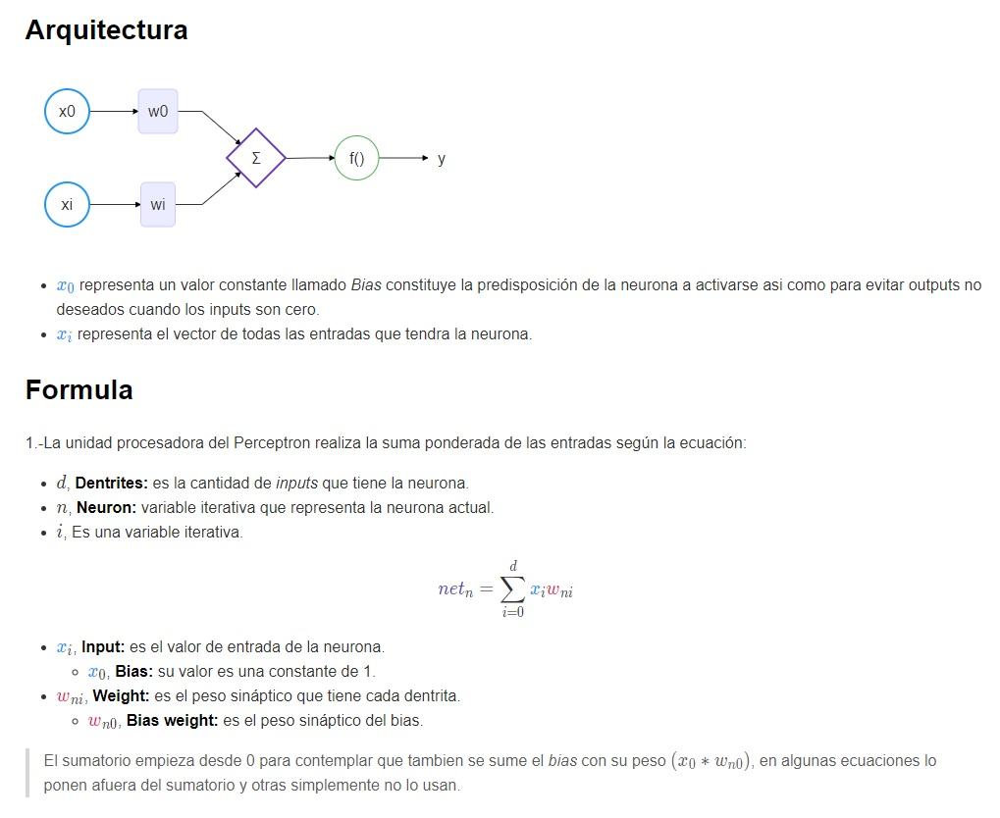

# Perceptron Simple

El Perceptrón sirve únicamente para problemas linealmente separables y que sean de dos clases.  Esto quiere decir que trazando una línea, plano o hiperplano se puedan distinguir.

Por otra parte, el perceptrón es la única red neuronal que tiene un teorema de convergencia el cuál establece que, si el problema es linealmente separable, el perceptrón encontrará la solución. Aunque no se sabe cuanto tiempo le llevara encontrar la solución y mucho menos si la solución encontrada será la óptima, se sabe que se tendrá una solución.

[DEMO](https://mau-io.github.io/simple-perceptron-js/index.html)

[Documentacion](https://mau-io.github.io/simple-perceptron-js/doc_ES.html)