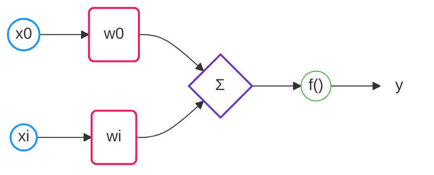

# 1.- Perceptron Simple

El Perceptrón sirve únicamente para problemas linealmente separables y que sean de dos clases.  Esto quiere decir que trazando una línea, plano o hiperplano se puedan distinguir.

Por otra parte, el perceptrón es la única red neuronal que tiene un teorema de convergencia el cuál establece que, si el problema es linealmente separable, el perceptrón encontrará la solución. Aunque no se sabe cuanto tiempo le llevara encontrar la solución y mucho menos si la solución encontrada será la óptima, se sabe que se tendrá una solución.

## Arquitectura

- $x_0$  representa un valor constante llamado *Bias* constituye la predisposición de la neurona a activarse asi como para evitar outputs no deseados cuando los inputs son cero.
- $x_i$  representa el vector de todas las entradas que tendra la neurona.

## Formula

1.-La unidad procesadora del Perceptron realiza la suma ponderada de las entradas según la ecuación:

- $d$, **Dentrites:** es la cantidad de *inputs* que tiene la neurona.
- $n$, **Neuron:** variable iterativa que representa la neurona actual.
- $i$, Es una variable iterativa.

$$
\color{#673AB7} {net}_n =
\sum \limits_{i=0}^d
\color{#2196F3} x_i
\color{#E91E63} w_{ni}
$$

- $\color{#2196F3} x_i$, **Input:** es el valor de entrada de la neurona.
  - $\color{#2196F3} x_0$, **Bias:**  su valor es una constante de 1.
- $\color{#E91E63} w_{ni}$, **Weight:** es el peso sináptico que tiene cada dentrita.
  - $\color{#E91E63} w_{n0}$, **Bias weight:** es el peso sináptico del bias.

>El sumatorio empieza desde 0 para contemplar que tambien se sume el *bias* con su peso $(x_0  * w_{n0} )$, en algunas ecuaciones lo ponen afuera del sumatorio y otras simplemente no lo usan.

- - -
2.- Despues de la suma de las entradas ponderadas, el resultado se pasa a una funcion generando la salida, según la ecuación:

$$
f( \color{#673AB7} {net}_n  )
$$

- $\color{#673AB7} {net}_n$, Es la **Suma neta** de los valores de entrada de la neurona multiplicados con sus pesos.
- $f()$, Es una funcion y representaria el *"estado de activación"* de la neurona, puede ser lineal, sigmoidea, tangente hiperbólica, etc.

3.- El resultado $\color{#4CAF50} y_n$, se obtiene despues con la siguiente comprobacion:

$$
\color{#4CAF50} y_n = {
  \begin{cases}
    1 & { \text{if }} f( \color{#673AB7} {net}_n  ) > 0
    \\
    0 & { \text{if }} f( \color{#673AB7} {net}_n  ) \leq  0
  \end{cases}
}
$$

- $\color{#4CAF50} y_n$, **Output:** representa el valor de salida de la neurona $n$.

- - -
**Ejemplo**

> Los pesos iniciales son aleatorios y se recomienda que se encuentren en un rango de -0.5 a 0.5.

## Aprendizaje

Para poder aprender, las redes neuronales utilizan algun *algoritmo de aprendizaje*.

Esto se obtiene introduciendo unos valores de entrada, y los valores de salida generados por esta se **comparan** con los valores de salida correctos. Si hay **diferencias**, se **ajustan** los  **pesos sinápticos** utilizando el *algoritmo de aprendizaje* de tal manera que el error vaya disminuyendo hasta que la salida sea la correcta.

> Basicamente los valores que tienen los pesos sinápticos $w$, representan el conocimiento que tiene una RNA.

#### Aprendizaje por correcion de error

Para el primer tipo de aprendizaje, utilizando tasa de aprendizaje, utilizaremos la siguiente regla de actualización de los pesos:

- $n$, **Neuron:** variable iterativa que representa la neurona actual.
- $i$, Es una variable iterativa.

$$
\color{#E91E63} w_{ni}^{new} =
\color{#E91E63} w_{ni}^{old} +
\color{#673AB7} \alpha( d_n - \color{#4CAF50} y_n )
\color{#2196F3} x_i
$$

- $\color{#E91E63} w_{ni}^{new}$ es el vector de pesos que se usará en la siguiente iteración en la posición $n$ $i$.
- $\color{#E91E63} w_{ni}^{old}$ es el vector de pesos actual en la posición $n$ $i$.
- $\color{#673AB7} \alpha$, **Learning rate:** es una constante llamada *razón de aprendizaje*,  tal que $ 0 < \alpha < 1$ y se fija de antemano por uno.
- $d_n$, **Delta:** representa el valor de salida correcto.
- $\color{#4CAF50} y_n$ es la salida que dio la neurona a las entradas que se le dieron.
- $\color{#2196F3} x_i$ denota el elemento en la posición $ i $ en el vector de la entrada.

